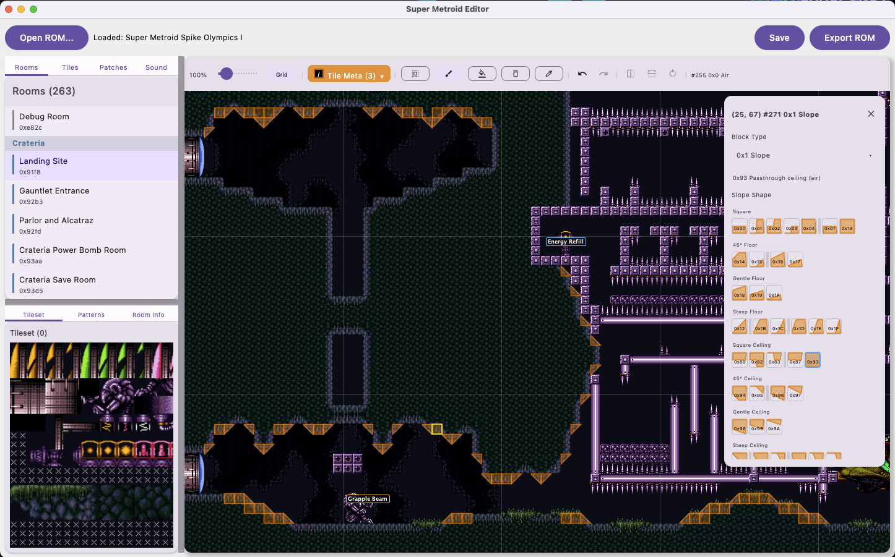
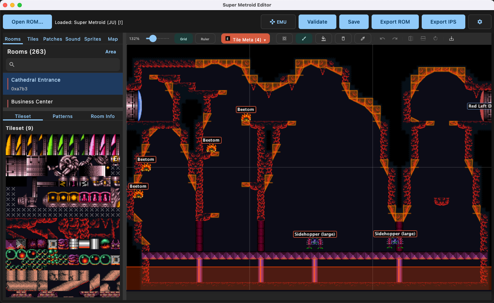
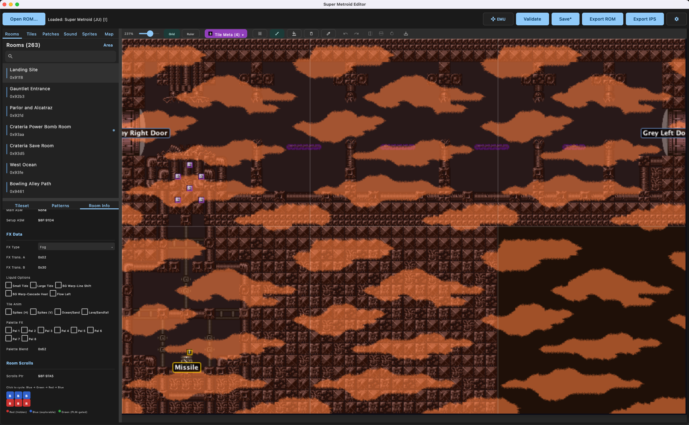
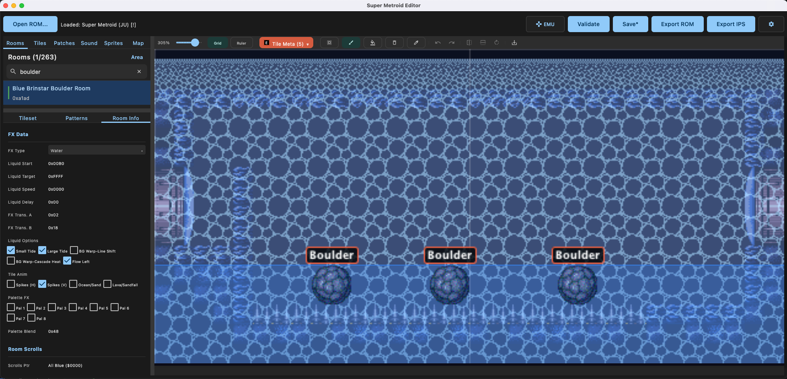
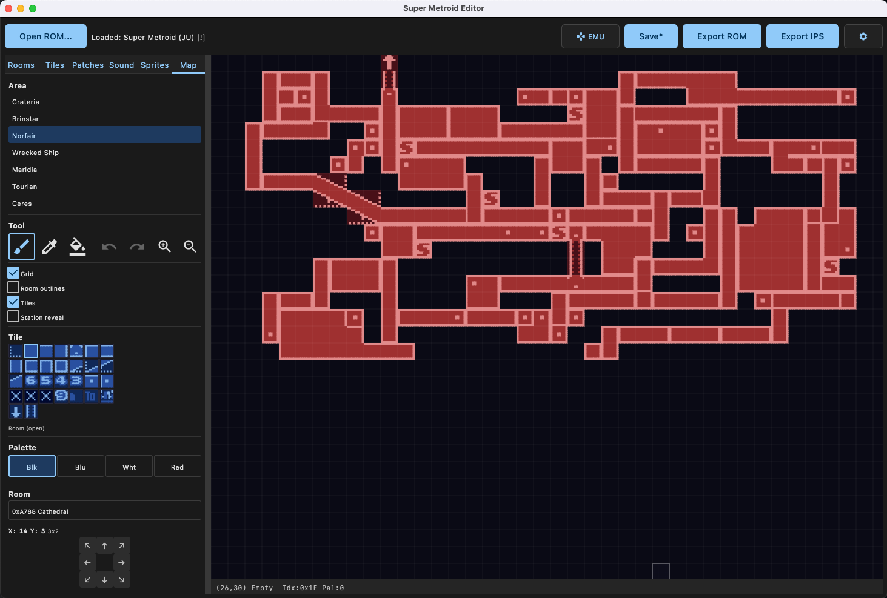
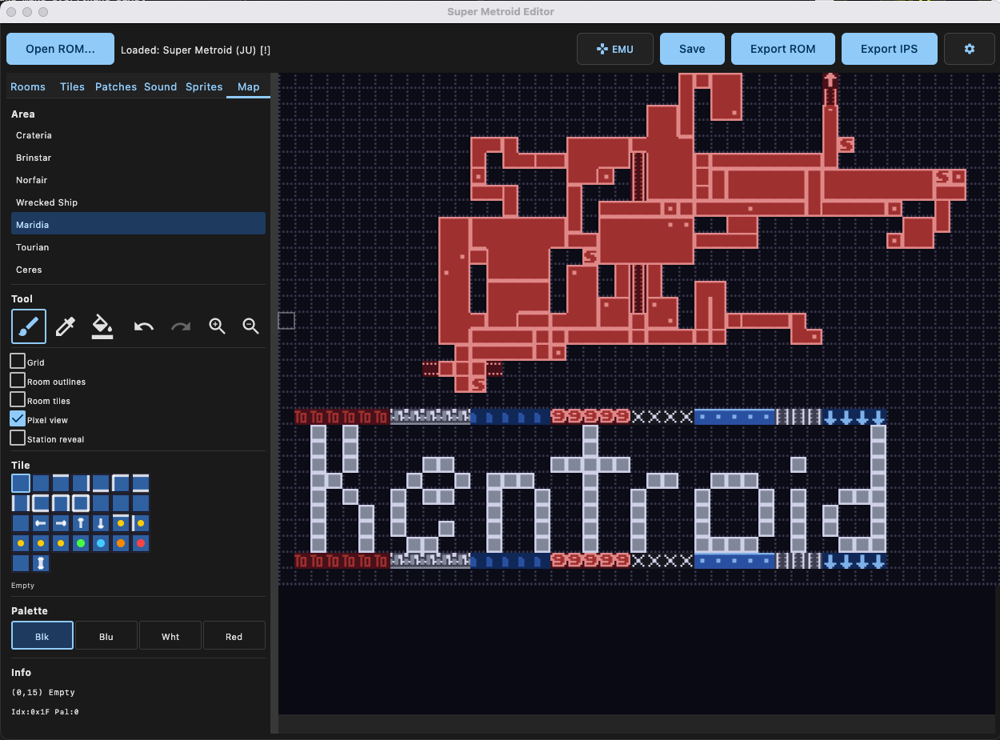
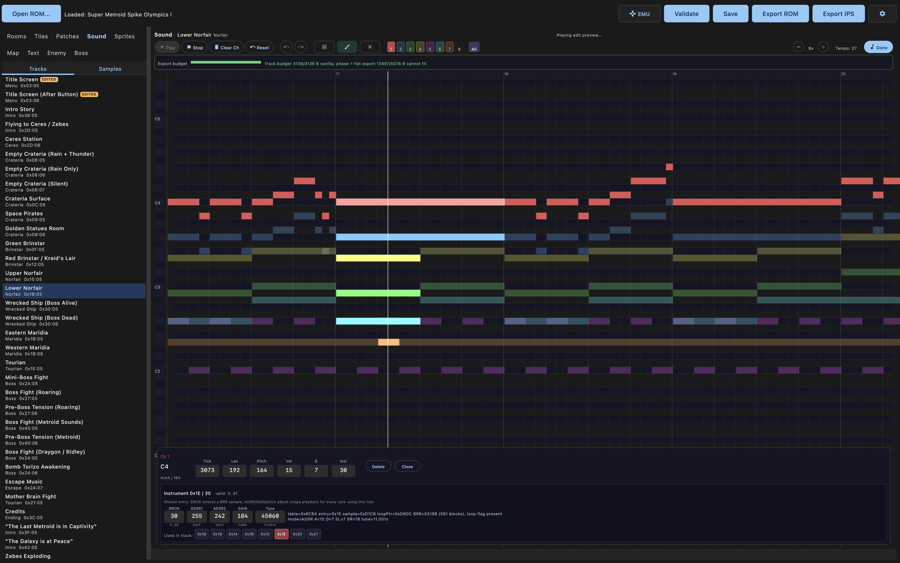

#  Super Metroid Editor (SMEDIT)

The MS Paint of Super Metroid ROM hacking. A native cross-platform desktop editor built with Kotlin/Compose.


<p>
  
  
</p>

Exported Room Images

<p>
  
  
</p>

Tile Editor

<p>
  
  
</p>

<p>
  
 
</p>

Layer 3 FX

<p>
  
  
</p>

Sprite Editor

<p>
  
  
</p>
<p>
  
  
</p>

Minimap Editor

<p>
  
  
</p>

Patches

<p>
  
  
</p>
<p>
  
  
</p>
<p>
  
</p>

Sound

<p>
  
  
</p>


## Features

- **Room Editor** — Paint, fill, erase, and sample tiles with multi-tile brush support. Right-click any block to edit block type and BTS properties. Undo/redo with full history.
- **PLM Placement** — Place and remove doors, gates, items, save stations, refill stations, and other PLMs with correct IDs and parameters.
- **Enemy Editor** — View, place, and edit enemy positions and properties per room.
- **Tileset Browser** — Browse all 29 tilesets with palette visualization and per-tile defaults.
- **Pattern System** — Save reusable tile patterns (doors, gates, platforms). Built-in patterns for all door/gate colors and directions.
- **Patch Manager** — Apply, create, and manage IPS patches. Built-in patches for common hacks (beam damage, jump height, Ceres/end-game escape times, and Short Charge).
- **Sprite Editor** — View and edit boss/enemy sprite assemblies with per-frame animation preview.
- **Sound Editor** — Browse and preview all in-game music tracks with cycle-accurate SPC700 emulation via blargg's snes_spc.
- **Minimap Editor** — Edit pause-screen map tiles with pixel-perfect 2bpp rendering. Paint, fill, and eyedropper tools. Room position editing with D-pad controls and buffered move preview. Supports all 7 areas with grid, room outline, and station reveal overlays.
- **Embedded Emulator** — In-process snes9x emulator with controller support, save states, and live ROM patching. Edit and play without leaving the editor.
- **Block Overlays** — Toggleable overlays for solid, slope, door, spike, bomb, crumble, grapple, speed, shot blocks, items, and enemies.
- **Room Browser** — Browse all 263 rooms organized by area (Crateria, Brinstar, Norfair, Wrecked Ship, Maridia, Tourian, Ceres).
- **Project Files** — Save/load projects as `.smedit` JSON files. Export patched ROMs and IPS patches.
- **SMART ROM Inspection** — Load and inspect SMART-generated expanded ROMs in read-only mode. Editing/export for SMART ROMs is planned but disabled until writes can be proven safe.
- **Cross-Platform** — macOS (`.dmg`), Windows (`.msi`), and Linux (`.deb`) builds with bundled JRE.

## Download

Grab the latest release for your platform from [GitHub Releases](https://github.com/kennycason/super_metroid_editor/releases).

| Platform | Format |
|----------|--------|
| macOS    | `.dmg` |
| Windows  | `.msi` |
| Linux    | `.deb` |

## Building from Source

Requires JDK 17+ and a C++ compiler (Xcode CLI tools on macOS, `g++` on Linux, MinGW on Windows).

### Embedded Emulator (snes9x via libretro)

The editor includes an embedded SNES emulator powered by snes9x, loaded in-process via JNA. The snes9x core is built from source as a git submodule (`tools/snes9x`).

The emulator runs in a floating draggable/resizable window. Click the **EMU** button in the toolbar to toggle it. Press **Play** to export a patched ROM with all current edits applied and start the emulator.

**Controller support:** Bluetooth SNES controllers (and other SDL-compatible gamepads) are supported via Jamepad/SDL2. Save state combos follow the Super Metroid practice ROM pattern:
- `R + Y + SELECT` — Save state to current slot
- `L + Y + SELECT` — Load state from current slot
- `L + R + Y + D-Pad Up/Down` — Cycle save slot number

**Keyboard controls:** Arrow keys for D-pad, Z/X/A/S for B/A/Y/X, Q/W for L/R, Enter for Start, Tab for Select.

```bash
# Clone with submodules (required for SPC audio)
git clone --recurse-submodules git@github.com:kennycason/super_metroid_editor.git
cd super_metroid_editor

# Run the editor
./gradlew :desktopApp:run

# Run tests
./gradlew :shared:jvmTest :desktopApp:jvmTest

# Package for your platform (.dmg / .msi / .deb)
./gradlew :desktopApp:packageDistributionForCurrentOS
```

If you already cloned without `--recurse-submodules`:
```bash
git submodule update --init --recursive
```

The native SPC library (`libspc`) is compiled automatically by Gradle from the `tools/snes_spc` submodule — no manual steps needed.

## CLI

The `cli` module provides headless ROM data export and patch building without a GUI dependency. See [CLI.md](CLI.md) for command usage, build JSON examples, IPS-only generation, and the shared headless API.

## Editing Approach

SMEDIT uses **binary ROM patching with smart data relocation** - Similar to SMILE, but edits are stored as non-destructive deltas in a project file (`.smedit` JSON) against an immutable ROM, and applied at export time.

When data grows beyond its original size (e.g., adding more items or enemies to a room than vanilla), the export pipeline automatically relocates the data to free space in the appropriate ROM bank and updates all pointers — including across multiple room states.

This approach supports the vast majority of ROM hacking use cases. The main constraints are finite free space in each ROM bank (solvable via ROM expansion) and the inability to change the engine's data structure formats (which would require a disassembly-based workflow). For context, SMILE used the same binary patching model and powered 15+ years of community hacks.

### ROM Compatibility

Vanilla-layout Super Metroid ROMs and SMILE-style 3 MiB ROM projects are editable. SMART-generated expanded ROMs can currently be opened for read-only inspection, including discovered rooms, rendered room data, pause-map data, text, sprites, and sound where SMEDIT can locate the relocated data. SMART editing/export is intentionally disabled for now because relocated data allocation and write-safety rules are still being hardened.

See [docs/project/plan.md](docs/project/plan.md) for the full roadmap including planned support for new room creation and ROM expansion.

## Roadmap

See [open issues](https://github.com/kennycason/super_metroid_editor/issues) for planned features and known bugs.

Planned:
- Layer 3 visual preview (fog, rain, heat shimmer rendering)
- Multi-state room editing (per-state enemies/PLMs/FX)
- Room creation, resizing, and state management
- Door expansion and new door connections
- ROM expansion beyond 3MB to eliminate free space limits
- Custom tileset importing and tile swapping
- Sound editing / synth

## Contributing

Pull requests welcome. Run `./gradlew :shared:jvmTest :desktopApp:jvmTest` before submitting to make sure all tests pass.

## Special Thanks

This project would not be possible without the incredible Super Metroid ROM hacking community and the resources they've built over the years.

### Documentation & Research
- **[Metroid Construction Wiki](https://wiki.metroidconstruction.com/)** — the central hub for Super Metroid ROM hacking knowledge
- **[Patrick Johnston's Annotated Disassembly](https://patrickjohnston.org/bank/)** — per-bank disassembly with full annotations, critical for understanding door systems, PLM sets, and boss AI
- **[Kejardon's SM Documentation](https://patrickjohnston.org/ASM/ROM%20data/Super%20Metroid/Kejardon's%20docs/)** — authoritative sources for room headers, state data, and PLM structures
- **[SNESLab Wiki](https://sneslab.net/wiki/Graphics_Format)** — SNES graphics format reference
- **[snes.nesdev.org](https://snes.nesdev.org/wiki/Tiles)** — SNES tile system documentation

### Projects & Tools
- **[SMILE Editor](https://wiki.metroidconstruction.com/doku.php?id=sm:editor_utility_guides:smile2.5)** — the original Super Metroid level editor that powered 15+ years of community hacks and served as the architectural reference for binary ROM patching
- **[MapRandomizer](https://github.com/blkerby/MapRandomizer)** (maddo, kyleb) — door handling, room geometry, and ASM patch references
- **[Super Metroid Decompilation](https://github.com/snesrev/sm)** (snesrev) — full C reimplementation with struct definitions and per-bank implementations
- **[SM-SPC](https://github.com/PJBoy/SM-SPC)** (PJBoy) — fully symbolic, assemblable source code for Super Metroid's SPC audio engine
- **[SM Mod 3.0.80](https://metroidconstruction.com/SMMM/)** — community reference for species IDs and PLM editing conventions

### Bundled Patches
Many built-in patches are sourced from or inspired by community work:
- Respin (Kejardon, P.JBoy)
- Fast Doors (NobodyNada)
- Momentum Conservation (Scyzer, Nodever2, OmegaDragnet7)
- Vanilla Bugfixes (total, PJBoy, strotlog, ouiche, Maddo, NobodyNada, Stag Shot)
- Skip Intro / New Game (theonlydude - RandomMetroidSolver, maddo)

### Embedded Libraries
- **[snes9x](https://github.com/snes9xgit/snes9x/)** — SNES emulator by Gary Henderson, Jeremy Koot, and many others, loaded via libretro
- **[snes_spc](http://www.slack.net/~ant/libs/audio.html#snes_spc)** (Shay Green / blargg) — cycle-accurate SPC700 APU emulator for music playback
- **Jamepad** — SDL2-based gamepad support for controller input
- **JNA** — Java Native Access for loading native libraries in-process
