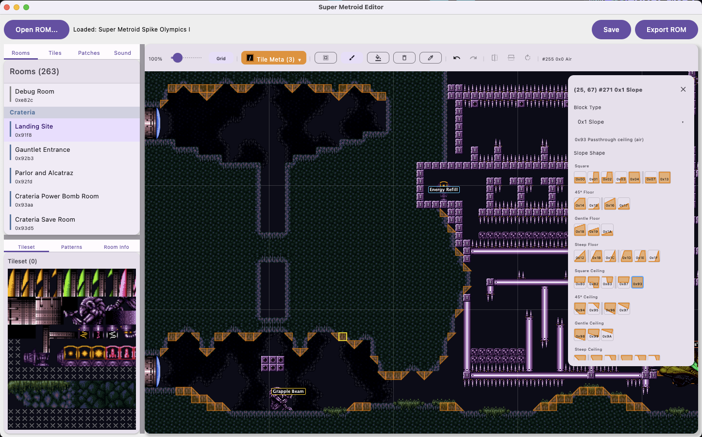
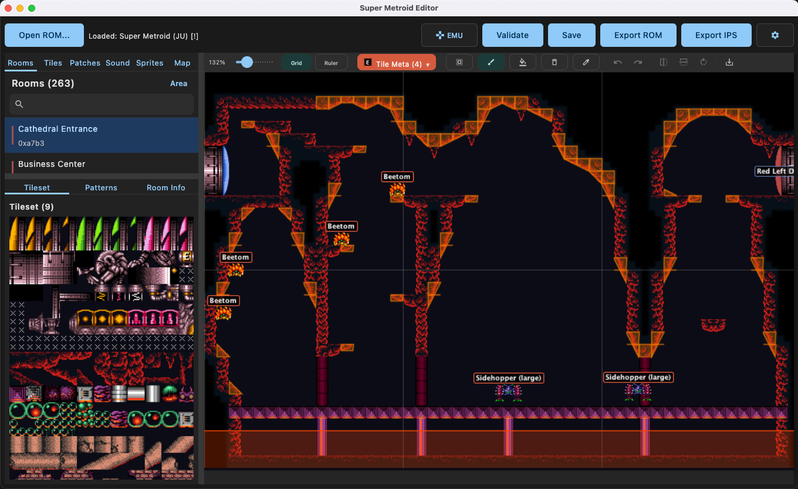
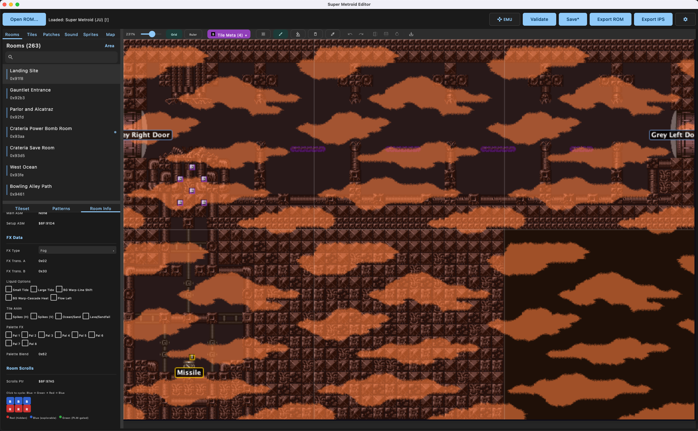
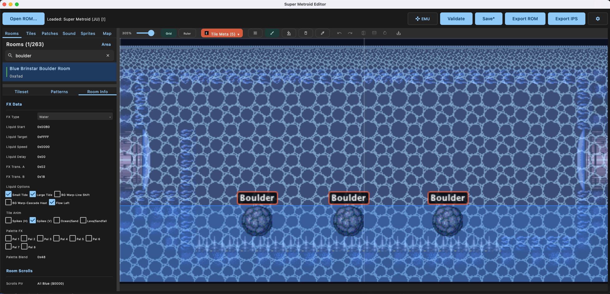
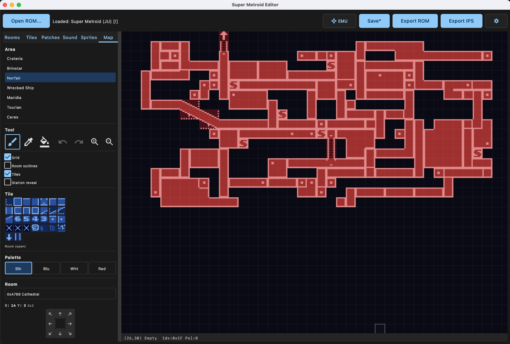
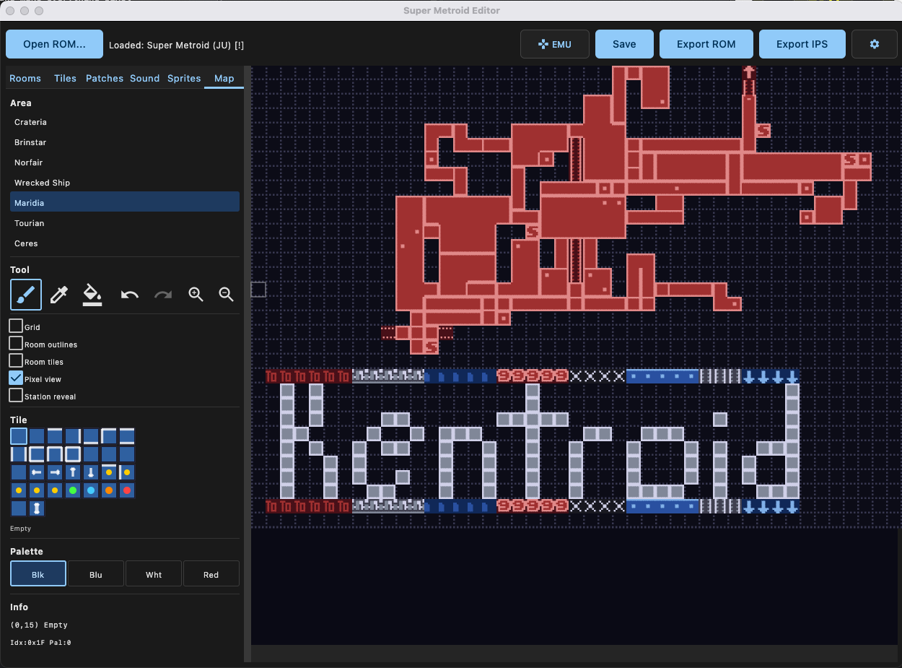
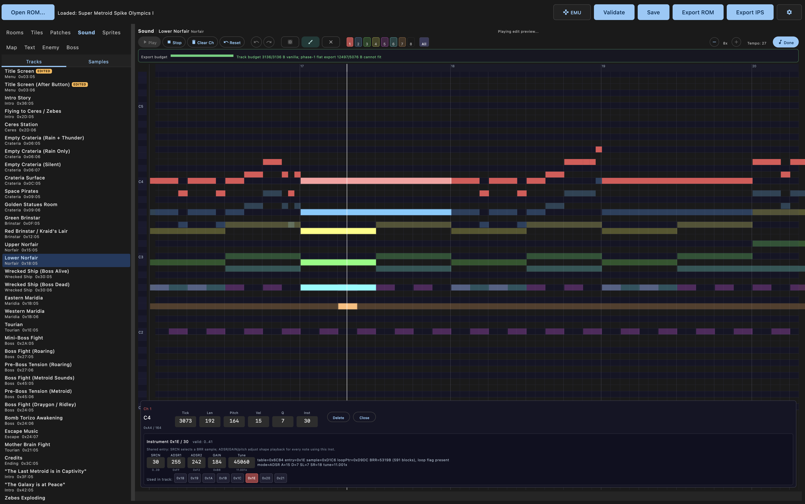

#  Super Metroid Editor (SMEDIT)

The MS Paint of Super Metroid ROM hacking. A native cross-platform desktop editor built with Kotlin/Compose.


<p>
  
  
</p>

Exported Room Images

<p>
  
  
</p>

Tile Editor

<p>
  
  
</p>

<p>
  
 
</p>

Layer 3 FX

<p>
  
  
</p>

Sprite Editor

<p>
  
  
</p>
<p>
  
  
</p>

Minimap Editor

<p>
  
  
</p>

Patches

<p>
  
  
</p>
<p>
  
  
</p>
<p>
  
</p>

Sound

<p>
  
  
</p>


## Features

- **Room Editor** — Paint, fill, erase, and sample tiles with multi-tile brush support. Right-click any block to edit block type and BTS properties. Undo/redo with full history.
- **Stateful Room Editor** — Inspect and author ordered `IF` / `ELSE IF` / `ELSE` room versions; edit state-scoped layouts, objects, enemies, scrolls, music, tilesets, and FX; build compound conditions; simulate first-match selection; and safely relocate/export changed state graphs.
- **New Room Creation** — Create a blank room or clone the currently visible room state, edit it immediately, add named door connections without entering ROM pointers, and export a complete native room graph.
- **PLM Placement** — Place and remove doors, gates, items, save stations, refill stations, and other PLMs with correct IDs and parameters.
- **Enemy Editor** — View, place, and edit enemy positions and properties per room.
- **Tileset Browser** — Browse all 29 tilesets with palette visualization and per-tile defaults.
- **Pattern System** — Save reusable tile patterns (doors, gates, platforms). Built-in patterns for all door/gate colors and directions.
- **Patch Manager** — Apply, create, and manage IPS patches. Built-in editors cover beam and environmental damage, Samus physics, escape timers, Short Charge, and more.
- **Sprite Editor** — View and edit boss/enemy sprite assemblies with per-frame animation preview.
- **Sound Editor** — Browse and preview all in-game music tracks with cycle-accurate SPC700 emulation via blargg's snes_spc.
- **Minimap Editor** — Edit pause-screen map tiles with pixel-perfect 2bpp rendering. Paint, fill, and eyedropper tools. Room position editing with D-pad controls and buffered move preview. Supports all 7 areas with grid, room outline, and station reveal overlays.
- **Embedded Emulator** — In-process snes9x emulator with controller support, save states, and live ROM patching. Edit and play without leaving the editor.
- **Block Overlays** — Toggleable overlays for solid, slope, door, spike, bomb, crumble, grapple, speed, shot blocks, items, and enemies.
- **Room Browser** — Browse all 263 rooms organized by area (Crateria, Brinstar, Norfair, Wrecked Ship, Maridia, Tourian, Ceres).
- **Project Files** — Save/load projects as `.smedit` JSON files. Export patched ROMs and IPS patches.
- **Expanded ROM Inspection** — Discover and inspect rooms in supported expanded-ROM layouts in read-only mode. This has been tested with SMART-generated output; no SMART project data is loaded or stored.
- **Cross-Platform** — macOS (`.dmg`), Windows (`.msi`), and Linux (`.deb`) builds with bundled JRE.

## Download

Grab the latest release for your platform from [GitHub Releases](https://github.com/kennycason/super_metroid_editor/releases).

| Platform | Format |
|----------|--------|
| macOS    | `.dmg` |
| Windows  | `.msi` |
| Linux    | `.deb` |

## Building from Source

Requires JDK 17+ and a C++ compiler (Xcode CLI tools on macOS, `g++` on Linux, MinGW on Windows).

### Embedded Emulator (snes9x via libretro)

The editor includes an embedded SNES emulator powered by snes9x, loaded in-process via JNA. The snes9x core is built from source as a git submodule (`tools/snes9x`).

The emulator runs in a floating draggable/resizable window. Click the **EMU** button in the toolbar to toggle it. Press **Play** to export a patched ROM with all current edits applied and start the emulator.

**Controller support:** Bluetooth SNES controllers (and other SDL-compatible gamepads) are supported via Jamepad/SDL2. Save state combos follow the Super Metroid practice ROM pattern:
- `R + Y + SELECT` — Save state to current slot
- `L + Y + SELECT` — Load state from current slot
- `L + R + Y + D-Pad Up/Down` — Cycle save slot number

**Keyboard controls:** Arrow keys for D-pad, Z/X/A/S for B/A/Y/X, Q/W for L/R, Enter for Start, Tab for Select.

```bash
# Clone with submodules (required for SPC audio)
git clone --recurse-submodules git@github.com:kennycason/super_metroid_editor.git
cd super_metroid_editor

# Run the editor
./gradlew :desktopApp:run

# Run tests
./gradlew :shared:jvmTest :desktopApp:jvmTest

# Package for your platform (.dmg / .msi / .deb)
./gradlew :desktopApp:packageDistributionForCurrentOS
```

If you already cloned without `--recurse-submodules`:
```bash
git submodule update --init --recursive
```

The native SPC library (`libspc`) is compiled automatically by Gradle from the `tools/snes_spc` submodule — no manual steps needed.

### ROM/disassembly parity development

The optional [parity harness](parity/README.md) provisions a pinned Super Metroid
disassembly checkout and validates a user-supplied clean ROM for source-backed
regression tests. It is developer tooling only; the editor and release builds have
no dependency on the ROM or disassembly checkout.

After configuring `SMEDIT_TEST_ROM`, `./gradlew parityBuildReference` performs the
complete pinned asset-extraction and assembly build, including a byte-identity check.
Use `./gradlew parityReport` to run the complete strict regression and generate an
ignored JSON/Markdown evidence bundle. The suite independently checks all extracted
asset ranges, LZ5 streams, tileset/CRE pointers, tile and metatile decoding, animated
tiles, item-PLM graphics, and all 164 enemy species headers plus their raw `GRAPHADR`
ownership and aliases, plus all 2,312 named standard and 811 extended enemy OAM
structures. It also inventories all 1,139 named enemy instruction lists and reports
every frame the current best-effort preview scanner misses. These checks are
deliberately source-backed: plausible-looking renders are not counted as parity
unless named disassembly data, rebuilt-ROM bytes, and SMEDIT's production path agree.
Samus now has the same source-backed foundation: all 253 pose IDs / 1,982 frame
occurrences, 127 delay streams, 435 DMA payloads, 422 referenced spritemaps, and the
three normal suit palettes are pinned. Every frame is checked through the production
decoder for exact tilemap geometry and reconstructed VRAM; reviewed pose goldens,
special palette programs, and community-sheet editing remain the next layer. The
community path now has an exact non-mutating Kotlin decoder for SpriteSomething's
876 x 2543 PNG contract: four pinned MapRandoSprites sheets, including Invisible
Samus, match the upstream extractor across all 637 named regions. The Samus workspace
provides guided read-only metadata, validation, search, region, and palette previews;
project-owned round trips and guarded ROM injection remain staged follow-ups.
Zoomer, Sidehopper, and the grey walking Space Pirate additionally have complete
header → graphics/palette → instruction path → OAM composition → rendered-animation
vertical slices. Puyo, Owtch, Choot, both Sbug/roach headers, the two-header Evir
family, Magdollite, Beetom, the three Kihunter color bodies, and both Sidehopper corpse
headers also have explicit
source routes for init AI that selects animations through helpers or state tables:
59 compact editor actions cover 255 guided frames without pretending the generic
scanner emulates their AI.
A separate source-complete ledger probes all 164 species through the
production renderer and distinguishes assembled, composite, tile-sheet-only,
nonvisual, and failed support without counting a raw tile sheet as a successful sprite.
It also models all eight visual species with zero-byte header transfers through exact
read-only shared/global VRAM providers, bringing the pinned ledger to zero failed
species without granting those headers false tile edit/export ownership. Palette
ownership is tracked separately because five of those headers still load and own
their palette row. Every formerly tile-sheet-only header now has an assembled,
composite, or explicitly non-drawing engine-helper classification.
Kraid additionally has a dedicated complete-composition proof: the no-CRE tileset
`$1A` graphics, active and unreferenced compressed BG2 maps, four custom-interpreter
head frames, mouth hitboxes, every health/hurt/death palette state, and the eight
headers linked to `$AB:CC00`. The production editor renders all four live 64×64 BG2
body states and their exact head sequences, ten selectable runtime palette stages,
and a representative full assembly with the linked arm/claw and front foot. Twelve
bounded linked-OAM animations cover 173 frame occurrences. Mini Kraid separately
uses its six exact action lists (24 frame occurrences / 14 unique poses), avoiding the
old shared-bank scan that mixed in Ridley data. Deterministic pixel hashes cover every
one of those frames, while head pixel edits save through the ordinary complete-tileset
relocation path. `./gradlew parityKraid` runs that focused slice.
Phantoon has the same complete-composition treatment: all four independently animated
enemy slots, 22 active BG2 tilemaps and extended-spritemap wrappers, 19 instruction
lists, three hitbox sets, the room-tileset pixel owner, separate raw OBJ payload, and
all eight health palettes are pinned. The editor renders every component, nine gaze
poses, and five bounded part animations as complete 80×112 compositions, with
deterministic hashes and safe `varGfx["5"]` pixel ownership. `./gradlew parityPhantoon`
runs that focused slice.
Draygon now has a dedicated split-owner renderer instead of a hand-picked boss-pose
scan. It combines tileset `$1C` BG2 graphics with the shared `$B0:C800` OBJ payload,
assembles body/eye/tail/arms at runtime coordinates, exposes ten poses, all eight
health stages plus hurt flash, and renders all 39 frame-bearing source lists (250
complete frame occurrences). Its exact `$2000` OBJ owner is editable in Sources via
`spriteTileBlocks["enemy:DE3F"]`; every named composition updates live while painting.
BG2/OBJ placement and flattened composite editing remain read-only.
`./gradlew parityDraygon` runs the focused proof. Sprite navigation presents one
Draygon entry and one Phantoon entry; their eye/tail/arms and eye/tentacle/mouth slots
live inside those complete boss editors instead of appearing as duplicate top-level
rows.
Ridley now follows the same model. Ceres `$E13F` and Norfair `$E17F` remain distinct
ROM encounters but share one top-level Ridley workspace because their five-part
`$B0:9400..B3FF` source, palette, body, wings, tail, and ribs/claws machinery are the
same. Its forward turn also resolves the enemy set's read-only `$B0:B400` auxiliary
payload at physical OBJ tiles `$E0..FF`, instead of misreading local tail art.
Ceres-only lunge and baby-Metroid retrieval actions are labeled inside the animation
browser. `./gradlew parityRidley` pins both headers, the exact two-page VRAM layout,
11 body maps, 12 wing maps, 19 tail maps, six runtime DMA assets, four palettes, and
deterministic complete composition/animation pixels.
Mother Brain now has the same focused treatment. The editor keeps phase 1's enemy
head distinct from its room-owned glass/machinery, while phase 2 assembles the
tileset-$0E torso, staged head/limb OBJ, body supplement, five neck segments, and
independent head. Four health pairs and all ten rainbow palette records are selectable;
the exact head source is editable with live phase-1/2 references, while the combined
four-owner body sheet is read-only. `./gradlew parityMotherBrain` pins both headers,
all head/body/BG2 maps, 49 body/head lists / 243 timed frames, and deterministic
composition/animation pixels.
Crocomire now follows the same source-owned model across its entire visual lifecycle.
The editor combines tileset `$1B` BG2 art with the editable `$AD:8000` living OBJ
payload, then swaps in the exact two melting overlays and six skeleton DMA chunks for
death frames. `./gradlew parityCrocomire` pins both body/tongue headers, all 179 active
OAM/extended/BG2 structures, six palette rows, and all 36 active instruction lists /
233 timed frames. The guided workspace exposes 20 full animations grouped by Fight,
Tongue, Melting, and Skeleton while keeping each runtime pixel owner explicit.
Spore Spawn now has a complete cross-bank renderer as well. It combines the bank-`$A5`
extended-OAM body with the four bank-`$86` stalk projectiles using the exact runtime
segment interpolation, and consolidates the spawner/spore components, four health
palettes, and eight body death palettes. `./gradlew paritySporeSpawn` pins the shared
`$AC:9C00` pixel owner, all body/projectile maps, nine boss lists, and all 27 related
sprite/room palette rows.
Botwoon now has a dedicated position-history renderer instead of the earlier rigid
composite approximation. It combines the bank-`$B3` head with twelve animated body
projectiles and one tail from banks `$86/$8D`, selects each link's orientation from
its own history vector, preserves the independent body loop during spits, and exposes
all eight health palettes. `./gradlew parityBotwoon` pins the shared `$B7:E300` pixel
owner, active and unused head/projectile structures, critical history routines, and
17 guided animations / 87 rendered frames.
Bomb and Golden Torizo now share one source-accurate Torizo workspace rather than
appearing as duplicate encounter/orb headers. It keeps the editable `$AF:C200` body
distinct from eye/damage/egg-release DMA overlays, Golden egg pixels, and Bomb statue
fragments; all eight Golden health-palette pairs are selectable. `./gradlew parityTorizo`
pins 106 active full-body maps, 91 body-child maps, 70 bank-`$8D` projectile/effect
maps, 16 runtime transfers, and 236 guided body/projectile animation frames.
The normal Metroid now has an exact three-owner renderer instead of the earlier
hand-made shell approximation. It synchronizes bank-`$A3` insides with bank-`$B4`
shell and electricity sprite objects, including two source-labelled unused lists
that are reached by live fallthrough. `./gradlew parityMetroid` pins the shared
`$AE:9000` pixel owner, 31 total OAM maps, four independent companion tracks / 270
ticks, and deterministic complete animations. See
[the Metroid ownership note](docs/graphics/metroid.md).
Dedicated Kraid, Phantoon, Draygon, Ridley, Mother Brain, Crocomire, Spore Spawn, Botwoon, Torizo, and Metroid workspaces open on Animations and
follow the same top-level drill-down: Animations, Compositions, Components, and
Sources. If a future complex workspace has no animations it falls back to
Compositions. Component selection always renders the selected piece; edit buttons
appear only where its pixels map unambiguously back to one source owner.
Current coverage and the ordered expansion plan are tracked in
[the parity validation matrix](docs/validation/README.md).

## CLI

The `cli` module provides headless ROM data export and patch building without a GUI dependency. See [CLI.md](CLI.md) for command usage, build JSON examples, IPS-only generation, and the shared headless API.

An experimental masked categorical room generator can learn complete layer-1 tile words, block
types, slopes/BTS metadata, and structural door tiles from the lossless CLI training export. The
desktop editor can validate, repair, rank, preview, and apply its candidate bundles. See
[room_model/README.md](room_model/README.md) for the workflow.

## Editing Approach

SMEDIT uses **binary ROM patching with safe data relocation**. Edits are stored as native,
non-destructive deltas in a `.smedit` JSON project against an immutable ROM and are applied at
export time. `.smedit` is SMEDIT's own format; it is not a SMILE or SMART project wrapper.

When data grows beyond its original size (e.g., adding more items or enemies to a room than vanilla), the export pipeline automatically relocates the data to free space in the appropriate ROM bank and updates all pointers — including across multiple room states.

This approach supports the vast majority of ROM hacking use cases. The main constraints are finite free space in each ROM bank (solvable via ROM expansion) and the inability to change the engine's data structure formats (which would require a disassembly-based workflow). For context, SMILE used the same binary patching model and powered 15+ years of community hacks.

### ROM Compatibility

Standard-layout 3 MiB Super Metroid ROMs are editable, including ROMs previously modified by tools
that preserve that layout. Expanded or relocated ROMs can currently be opened for read-only
inspection when discovery succeeds, including rooms, rendered room data, pause-map data, text,
sprites, and sound where SMEDIT can locate them. Editing/export stays disabled because relocated
allocation and write-safety rules are not yet proven. The discovered catalog is derived in memory
from ROM bytes and is not serialized as foreign project metadata.

See [docs/project/project_format.md](docs/project/project_format.md) for the native project boundary
and [docs/project/room_model.md](docs/project/room_model.md) for the room/state model.

See [docs/project/plan.md](docs/project/plan.md) for the full roadmap, including new-room workflow follow-ups and managed ROM expansion.

## Roadmap

See [open issues](https://github.com/kennycason/super_metroid_editor/issues) for planned features and known bugs.

Planned:
- New-room deletion, minimap automation, reusable templates, and broader world-graph tooling
- Tileset/metatile composition and richer custom tileset workflows
- Room JSON import and one-way SMART XML → native SMEDIT translation
- Managed ROM expansion and a shared ownership-aware allocator
- Advanced Layer 2/background transfer workflows

## Contributing

Pull requests welcome. Run `./gradlew :shared:jvmTest :desktopApp:jvmTest` before submitting to make sure all tests pass.

## Special Thanks

This project would not be possible without the incredible Super Metroid ROM hacking community and the resources they've built over the years.

### Documentation & Research
- **[Metroid Construction Wiki](https://wiki.metroidconstruction.com/)** — the central hub for Super Metroid ROM hacking knowledge
- **[Patrick Johnston's Annotated Disassembly](https://patrickjohnston.org/bank/)** — per-bank disassembly with full annotations, critical for understanding door systems, PLM sets, and boss AI
- **[Kejardon's SM Documentation](https://patrickjohnston.org/ASM/ROM%20data/Super%20Metroid/Kejardon's%20docs/)** — authoritative sources for room headers, state data, and PLM structures
- **[SNESLab Wiki](https://sneslab.net/wiki/Graphics_Format)** — SNES graphics format reference
- **[snes.nesdev.org](https://snes.nesdev.org/wiki/Tiles)** — SNES tile system documentation

### Projects & Tools
- **[SMILE Editor](https://wiki.metroidconstruction.com/doku.php?id=sm:editor_utility_guides:smile2.5)** — the original Super Metroid level editor that powered 15+ years of community hacks and served as the architectural reference for binary ROM patching
- **[MapRandomizer](https://github.com/blkerby/MapRandomizer)** (maddo, kyleb) — door handling, room geometry, and ASM patch references
- **[Super Metroid Decompilation](https://github.com/snesrev/sm)** (snesrev) — full C reimplementation with struct definitions and per-bank implementations
- **[SM-SPC](https://github.com/PJBoy/SM-SPC)** (PJBoy) — fully symbolic, assemblable source code for Super Metroid's SPC audio engine
- **[SM Mod 3.0.80](https://metroidconstruction.com/SMMM/)** — community reference for species IDs and PLM editing conventions

### Bundled Patches
Many built-in patches are sourced from or inspired by community work:
- Respin (Kejardon, P.JBoy)
- Fast Doors (NobodyNada)
- Momentum Conservation (Scyzer, Nodever2, OmegaDragnet7)
- Hyper Beam Item (SMEDIT; placeable native Hyper Beam pickup with no custom inventory bit)
- Vanilla Bugfixes (total, PJBoy, strotlog, ouiche, Maddo, NobodyNada, Stag Shot)
- Skip Intro / New Game (theonlydude - RandomMetroidSolver, maddo)

### Embedded Libraries
- **[snes9x](https://github.com/snes9xgit/snes9x/)** — SNES emulator by Gary Henderson, Jeremy Koot, and many others, loaded via libretro
- **[snes_spc](http://www.slack.net/~ant/libs/audio.html#snes_spc)** (Shay Green / blargg) — cycle-accurate SPC700 APU emulator for music playback
- **Jamepad** — SDL2-based gamepad support for controller input
- **JNA** — Java Native Access for loading native libraries in-process
